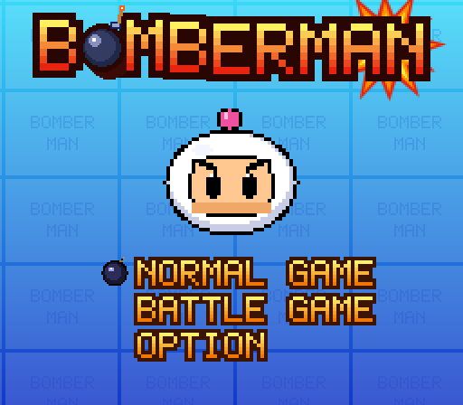
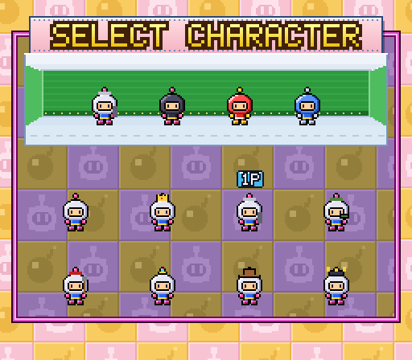
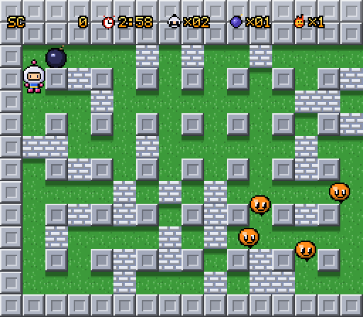
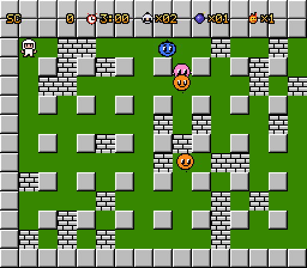
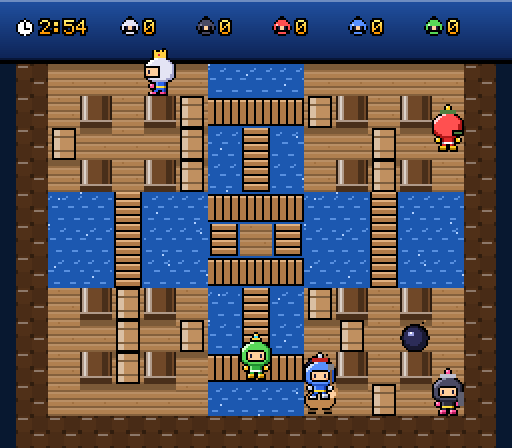
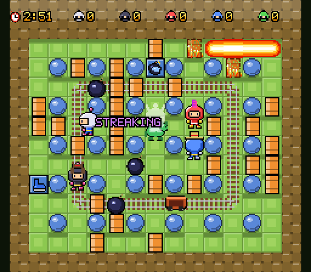

# Bomberman — PlayStation fan remake for the web

A browser remake of **Bomberman** for the original PlayStation (Japan 1998, Europe 1999,
released in North America as *Bomberman Party Edition*). It covers the 50-stage
**Normal Game** and the five-player **Battle Game**. It is written in TypeScript and runs
on an HTML5 canvas at the original 256×224 resolution.

| | | |
|---|---|---|
|  |  |  |
|  |  |  |

> **Unofficial fan project.** It is not affiliated with or endorsed by Konami or Hudson
> Soft. "Bomberman" is their trademark and is used here only to name the game being
> remade. Every sprite, tile, tune and sound effect in this repository is original,
> drawn or synthesised in code. No ROM data or ripped assets are used. Only the rules
> and structure of the game are reproduced.

## Play

```sh
npm install
npm run dev          # http://localhost:5173
```

`npm run build` produces a static site in `dist/` that runs from any path or web server.
The game needs no backend.

## Controls

| | Keyboard (one player and menus) | Gamepad (default) | Touch |
|---|---|---|---|
| Move | Arrows / WASD | D-pad / left stick | on-screen pad |
| **A**: bomb, confirm, Power Glove (hold) | Space / X / J / F | bottom face button | A |
| **B**: special, partner ability, back | Z / K / G / Shift | right face button, LB, RB | B |
| **C**: Push, Punch, Multi Bomb | C / E / L | left face button, LT, RT | C |
| **D**: stop a kicked bomb, back | Q / V / I | top face button | C |
| Start / pause | Enter / P | Start | START |
| Select / back | Esc / Backspace / Tab | Back | SELECT |

In the Battle Game, B with a direction fires an Advanced character's special; B on its
own uses the partner's ability. Option → Controller Options has a page for each gamepad,
as in the original: vibration on or off, and which face button does each function. The
PlayStation original puts bombs on ○, specials on ×, stopping kicked bombs on △ and
punches on □.

In the Battle Game two people can share one keyboard.

| | Move | A | B | C | D |
|---|---|---|---|---|---|
| Keyboard P1 | WASD | Space / F | Left Shift / G | E / R | Q / T |
| Keyboard P2 | Arrows | Enter / Numpad 0 / `/` | Right Shift / `.` | Right Ctrl / `,` / Numpad 1 | `'` / `;` / Numpad 2 |

Gamepads 1–4 can be assigned to any player on the setup screen, which allows up to five
humans with a keyboard pair and gamepads. When typing a password, the keyboard types
letters directly.

## What's in it

### Normal Game (1 player)

- **50 stages** on a 31×13 scrolling field. Each stage has the original fixed monster
  roster and power-up; the layout is random on every attempt (50 + 2 × stage soft
  blocks, with the exit and the item hidden under two of them).
- **8 monsters** with the original speeds, points and behaviours. Pass dodges bombs.
  Kondoria, Ovapi and Pontan go through walls. Pontan charges.
- **Rules:**
  - 3:00 timer; Pontans swarm in when it runs out.
  - Bombing the exit or the item spawns a penalty pack of monsters.
  - Chain-kill points double.
  - Lives: ×02 at the start and +1 per cleared stage.
- **Power-ups:** Fire, Bomb, Speed Up, Remote Control, Bomb Pass, Wall Pass, Fireman and
  Flak Jacket. Some are lost when you lose a life.
- **Bonus stages** after every fifth stage: 30 s, invincible, endless monsters.
- **Six hidden score panels**, from B (10,000 points) to Tekuteku Angel (20,000,000),
  each with its original trigger condition.
- **Versions:**
  - **Modern:** five world themes and "Bomberman Show Time" skits every ten stages.
  - **Retro:** NES-style tiles, sprites, flames and chiptune arrangements.
- **Progress:**
  - Game Over offers Continue, Save or Quit.
  - 8-character passwords. The original game's stage and full-power codes work too.
  - Three memory-card save files, stored in the browser.
  - An ending with a staff roll.

### Battle Game (1–5 players, humans and CPUs)

- **Modes:** Battle Royal and Custom Battle (Item Selection with 15 items, and a
  hit-point Handicap), in Single or Tag (team) play.
- **Rules** follow the PS1 options:
  - COM level, games per match and time.
  - Sudden Death (Off or On), Random Position (Off, On or Random), and Skull.
  - Hyper Bomber.
  - Bomber Cart: off, on or Super.
- **24 stages**, eight each for Beginner, Normal and Advanced, with their gimmicks. Each
  has an alternate with fixed blocks and a different item mix, and most have their own
  layout of pillars and gimmicks. The original's
  battle passwords open them level by level: `56565656`, `16161616` and `49894989`,
  typed on the password screen.
  Gimmicks include see-saws, trolleys and switches, arrows, pipes, conveyor belts,
  warps, a two-floor stage split between a cloud and the sky, pipes that pass blasts on,
  and big snow huts. The Advanced stages add a four-legged
  giant robot, turning flowers, jungle tunnels, L-shaped pipes, belts that run through
  the walls, the Super Power arena and the Seven Seas.
- **Items:**
  - Bomb, Fire, Full Fire (edge to edge), Speed, Kick, Bomb Pass, Punch, Push.
  - Power Glove: throw bombs or other players, and bat thrown bombs back while holding one.
  - Multi Bomb, Power, Rubber and Metabomb (pierce) bombs, Land Mine.
  - Egg (a riding partner with its own ability), Skull (ten diseases, which spread by
    touch).
  - Steel Shoes (−speed) and Hearts come from Hyper Bomber, Wall Pass from some
    alternate stages, and the Flak Jacket from Custom Battle only, as in the original.
- **Other features:**
  - Advanced characters with specials: rocket, beam, jet boost, hammer, invincibility,
    pistol and sword shockwave. Ten partners, including an Advanced rider's stocked egg
    that trails behind them.
  - Colliding kicked bombs make a Dangerous Bomb (5×5); two Power Bombs make a Super
    Dangerous Bomb (7×7).
  - "Hurry!" pressure-block spiral, TIME'S UP draws.
  - Bomber Carts for knocked-out players.
  - Hyper Bomber prize game, the results screen (a trophy per win), the Battle Report
    (Fragged / Fragged By columns under each portrait), a draw screen (a drawn game
    doesn't count) and the victory screen, where the winner is tossed in the air in the
    ring (Single) or inside a garland of heads (Tag).
- **CPU players** read a danger map and use a time-aware escape search. They check that
  a bomb has an escape route before placing it, and they watch the stage: the trolley's
  route (through every warp hole), where the robot's feet will land, and bombs carried
  by belts or turned by arrows. There are
  three difficulty levels.

### Everything else

- **Title and menus:** the title screen opens the mode menu under the logo, with a
  **Demo Play** attract mode after 20 s idle. The menus follow the original's look (all
  redrawn): pastel wallpaper, purple-and-olive checked windows with a name plate across
  the top edge, pale-green lettering and a pointing-glove cursor. The password screen is
  a character roller.
- **Options:** stereo/mono audio, music and SE volume, numbered music and SE tests,
  screen position (move the picture until the "Can you read this?" banner shows),
  vibration and face buttons for each gamepad, and a keyboard reference.
- **Audio:** a small WebAudio synthesiser plays every tune and effect from note data.
  It includes pulse, saw and triangle voices, noise drums, reverb and NES-style voices
  for the Retro version.
- **Display:** pixel-perfect integer scaling, keyboard, gamepads (with rumble) and a
  touch layout for phones.

## Fidelity notes

- Timings follow the originals: 60 Hz fixed step, a 159-frame fuse, and player and
  monster speeds in px/frame. The stage tables (rosters, items, bonus stages and panel
  stages) follow the NES and PS1 data. `docs/SPEC.md` lists the sources and values.
- All 24 battle stages were read tile by tile from the stage screenshots in the Japanese
  manual, checked against the stages' background art, and the alternates from their own
  background art. The alternates' soft blocks follow fixed patterns because the
  originals' placements aren't documented.
- All music, Show Time skits, dialogue and artwork are new, written for this remake.

## Development

```sh
npm run typecheck    # tsc --noEmit
npm test             # Vitest unit tests (simulation, stages, battle rules, AI, audio)
npm run build        # typecheck + production build
npm run test:e2e     # Playwright smoke tests against the production build (build first)
```

The simulation (`src/game`) is deterministic and never touches the DOM or audio. Scenes
read its event queue to play sounds and effects. That lets unit tests fuzz whole arenas
headlessly.

```
src/
  engine/     loop, input, canvas, bitmap font, scenes, storage
  audio/      synthesiser, sequencer, songs, sound effects
  game/core/  grid, movement, bombs, flames, the shared World
  game/campaign/  Normal Game: stages, monsters, passwords, saves
  game/battle/    Battle Game: rules, arenas, gimmicks, CPU AI, characters
  gfx/        procedural pixel art (bombers, monsters, tiles, items, effects)
  render/     field, HUD and UI drawing
  scenes/     title, menus, Normal and Battle Game screens
```

Debug URLs:

| URL | What it opens |
|---|---|
| `#play=N` | Normal Game stage N |
| `#play=Nr` | Stage N in the Retro version |
| `#battle=<id>` | You plus four CPUs on a battle stage |
| `#demo=<id>` | Five CPUs on a battle stage |
| `#demo=<id>x` | The same on the alternate layout (once that level is unlocked) |

Battle stage ids run `b1`–`b8`, `n1`–`n8` and `a1`–`a8`. In the browser, `window.__bomberman`
exposes the running app for tests.
